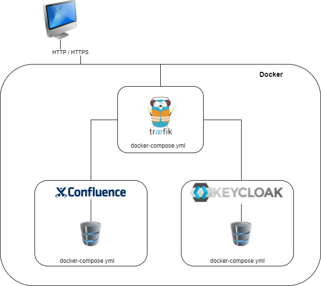

# Introduction

[traefik](https://traefik.io/) is a convenient way to have a reverse proxy in your Docker setup.

Docker containers hosting web applications or webservices can register in traefik
and traefik does routing, load-balancing, ssl termination and HTTP/2 for you out
of the box.

This works smoothly but we had the following setup:



We took a Atlassian confluence Wiki setup having it's own docker-compose.yml, a
keycloak WebSSO having it's own docker-compose.yml and traefik having it's own 
docker-compose.yml.

When using keycloak and confluence the following happenes:
1. the user opens confluence in the browser
2. confluence recognizes authentication is required and redirects to keycloak
3. keycloak does the authentication and redirects back to confluence
4. confluence decides if the user is authorized to see content

In this flow cconfluence needs to know keycloak and vice versa. As traefik does the
SSL termination for us the direct communication between both containers is not sufficient
and traefik needs to do the routing.

# Challenge

As each application complex (traefik, confluence, keycloak) is connected to a virtual
network the applications can communicate, but Docker uses it's own internal DNS service
andd ignores i.e. settings in the hosts file.

The consequence is in the containers the full qualified name (FQDN) of the applications
is not known and only configured in traefik.

# Solution

There are three approaches to make the FQDNs known in the containers.

## Add host entry to container

In the docker-compose.yml there can be additional settings given for the container's 
hosts file, this is done in the `extra_hosts` part of the service:

```
version: "3"
services:
  confluence:
    ...
    extra_hosts:
      - "keycloak.my.domain:172.0.0.6" (internal IP of the traefik container)
    ...
```

Docker adds the additional setting in the hosts file and confluence now can use the
FQDN to access keycloak.

A drawback is we need to give a static IP which points to traefik, which is not very handy. 

## Set DNS server

By default Docker uses the Google's DNS server to resolve any host which can't be
resolved by the internal DNS.

If you use a DNS server in your network where all FQDNs hosted in Docker points to the 
Docker host (we only have a single Docker host), then you can configure docker-compose to
set this DNS server in the container.

```
version: "3"
services:
  confluence:
    ...
    dns:
      - 192.168.10.11 (IP of your DNS server)
    ...
```

A drawback is the central DNS server prohibits local development.

## Set container alias names

By default the used names in the Docker integrated DNS Server is the container name.

To route all requests to traefik, traefik needs to have all alias names set. This is
done in the `network` settings.

```yaml
version: "3"
services:
  traefik:
    ...
    networks:
      proxy:
        aliases:
          - keycloak.my.domain
          - confluence.my.domain
    ...
```

For local development this seems to be the most elegant solution but if you add a
new web application which needs to be handled by traefik. 

# Demo application

For demonstration purposes we created a small setup which is similar to the described
traefik, confluence and keycloak setup.

In the demo setup confluence and keycloak are replaced by nginx. 

## Setup

To run the demo application you need to have Docker and docker-compose installed.

### Hosts settings

To make the web applications accessible you need to add the following entries to
your local machine.

```
127.0.0.1  traefik.flex-guse.de
127.0.0.1  web1.flex-guse.de
127.0.0.1  web2.flex-guse.de
```

The IP is working if you use Windows 10 Pro with Docker installed. In every other case
you need to replace the IP with the IP of your Docker host machine.

## Startup

### traefik
Give the command `docker-compose up -d` in the folder `/traefik` to start traefik.

### application web1
The web1 application uses a custom dockerfile. To build the Docker image switch into the 
folder `/web1` and give `docker-compose build`.

To start the container use the command `docker-compose up -d`.

### application web2
The web1 application uses a custom dockerfile. To build the Docker image switch into the 
folder `/web2` and give `docker-compose build`.

To start the container use the command `docker-compose up -d`.

## Communication test

Test the routing from web1 to web2:
```bash
docker exec -it web1 sh -c "curl -k -v https://web2.flex-guse.de"
```

Test the routing from web2 to web1:
```bash
docker exec -it web2 sh -c "curl -k -v https://web1.flex-guse.de"
```

In both cases a HTML response is expected. As no nginx web application provides a
SSL certificate (traefik is the SSL endpoint), the response must be given by the
traefik route.